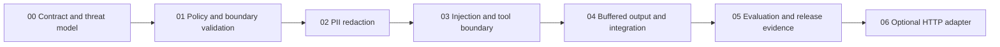

# Project 10 — Security Guardrail Middleware Implementation Plan

Status: IMPLEMENTATION IN PROGRESS. Phases 00–05 TESTED (checks recorded passing; owner acceptance pending), phase 06 IMPLEMENTED (load/supervisor drill pending). No security effectiveness or performance claim beyond recorded evidence; held-out evaluation and attack-prevention measurements are NOT RUN.

**Goal:** Build a small, auditable Python guardrail pipeline that reduces prompt-injection risk, redacts explicitly supported PII, and checks input and output before they cross an application boundary.

**Architecture:** An in-process library evaluates bounded text at four named boundaries. A host-owned authorization layer controls tools independently of the model. Responses are buffered until output evaluation completes. A narrow HTTP adapter is optional after the library passes evaluation.

**Tech stack proposal:** Python, Presidio analyzer/anonymizer with a pinned English NLP model, standard-library policy parsing and structured event serialization. Test framework and exact supported versions are verified in phase 00; no agent framework, database, hosted detector, or GPU is required.

**Spec:** [PRD](docs/product/PRD.md), [HLD](docs/architecture/HLD.md), [LLD](docs/architecture/LLD.md). This master owns scope, phase status, defaults and review gates. ADRs are candidates until owner acceptance. A changed contract must update master, PRD, LLD and affected phase together.

## Repository status

Planning folder fallback: no suitable Project 10 repository was identified in the parent task's bounded registered-project/source inventory. No repository or worktree was created. This is not a claim about every disk location. Before implementation, select an existing repository or initialize a dedicated repository, then create a planning/implementation branch or worktree. Graph tools were not exposed; project index and generation could not be verified. There is no existing code architecture being claimed here.

## Global constraints and defaults

- Planning only in this delivery; implementation requires the user's later approval.
- English text only; configured entity set: EMAIL_ADDRESS, PHONE_NUMBER, CREDIT_CARD, PERSON. Country-specific identifiers, images, audio, PDFs and multilingual coverage are excluded from the V1 claim.
- 16 KiB UTF-8 per boundary text, 64 KiB aggregate inspected text per application request, maximum four inspected blocks across user input, retrieved content, tool output and final output; reject oversize rather than truncate. Reserve remaining capacity before each stage and enforce newly produced text before forwarding or release; future output cannot be size-validated before generation. Host compacts larger evidence before this interface and must not silently bypass scanning.
- Failure of a mandatory detector, invalid policy, unsupported declared language or deadline exhaustion yields BLOCK with no text. Detectors and policy load before readiness.
- No raw content, detected values, reversible mappings or content hashes in telemetry. Sanitized text exists only in request memory and returned results; Python cannot guarantee secure memory erasure.
- No arbitrary tool execution, internet fetching or destructive actions. All tool proposals are untrusted. The demo tool is a local read-only synthetic catalog lookup.
- Project 08 and Project 09 are optional integrations; synthetic fixtures and local events suffice independently.
- No public service, real PII, paid model traffic or claims of universal injection prevention in V1.

## Phase dependency map

| Phase | Scope | Status | Review evidence |
|---|---|---|---|
| 00 | Environment, threat model, fixtures | TESTED | Compatibility and threat review (acceptance pending) |
| 01 | Policy, validated envelope, decisions | TESTED | Boundary and failure tests (12 passing) |
| 02 | Bounded PII detection/redaction | TESTED | Span and entity metrics (dev set; held-out pending) |
| 03 | Injection risk rules and tool authorization | TESTED | Direct/indirect and authorization tests |
| 04 | Full buffered input-to-output flow | TESTED | No-release-on-failure evidence |
| 05 | Held-out evaluation and release package | TESTED | Dev report recorded; held-out NOT RUN |
| 06 | Optional HTTP service | IMPLEMENTED | Auth/body-limit/parity tests; load drill pending |

Detailed plans: [phase index](implementation/README.md). Mandatory V1 stops after 05; 06 requires an actual consumer and explicit scope approval.

## Coding-agent workflow

1. Read this master, the current phase, linked concept notes, PRD and relevant ADRs. Confirm the selected repo/worktree and clean baseline. Never implement multiple phases by assumption.
2. Record accepted defaults, dependency versions, active policy digest and phase status IN_PROGRESS. Candidate ADRs do not imply user approval.
3. Write the smallest tests demonstrating the phase's required behavior and a failure path. Observe the expected failure, implement only owned files, then run targeted checks and the existing regression suite.
4. Inspect the diff for bypass paths, raw-content leakage and dependency growth. A reviewer evaluates security contracts and test adequacy; the implementer reconciles findings.
5. Attach actual commands, environment, pass/fail output and limitations to the phase evidence record. Use NOT_STARTED → IN_PROGRESS → IMPLEMENTED → TESTED → REVIEWED → COMPLETE. IMPLEMENTED means scoped changes exist, TESTED means recorded checks passed, REVIEWED means findings were resolved; COMPLETE requires acceptance. Record blocking reasons separately without replacing this status sequence. Never substitute a plan for a test result.
6. Update learning notes with one counterexample and one tradeoff. Do not upload payloads, publish a service or expose secrets through logs.

## Review gates and Definition of Done

G0: Owner accepts scope, English-only coverage, synthetic-data rule and implementation repository. G1: Threat boundaries and fail-closed behavior reviewed before detector implementation. G2: Phase-local tests and privacy inspection pass before merging a phase. G3: Held-out metrics, security invariants and operational drills reviewed before release. G4: Separate approval for HTTP/public deployment, real data, broader categories/languages or paid integrations.

V1 done means phases 00–05 accepted; deterministic boundary/tool/no-release invariants pass; held-out evaluation meets the provisional PRD targets or the owner explicitly narrows the claims; clean-install reproduction succeeds; no raw payloads in logs/traces/errors/artifacts; pinned dependencies and model licenses recorded; limitations and rollback tested; documentation and learning artifacts match actual behavior. Threshold revisions must precede reruns and remain visible. A failed target cannot be relabeled a pass.

## Review focus

1. Unicode normalization changes span offsets: phase 02 tests original-text replacement.
2. A tool response embeds instructions: phases 03–04 inspect it before model reuse.
3. Detector timeout occurs after generation: phase 04 proves zero bytes reach the user.
4. Benign security education triggers injection rules: phases 03 and 05 measure false blocks.
5. An error formatter or span trace leaks PII: phases 01, 04 and 05 inspect every event sink.

## Approval before implementation

Accept or revise the four-entity English scope, library-first design, fail-closed availability tradeoff, synthetic-only evaluation, provisional latency/quality targets and repository destination. Choose whether optional phase 06 is needed. No decision blocks completing this planning package.
