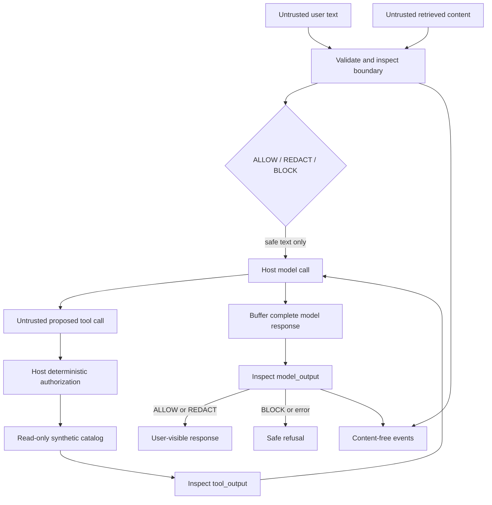

# High-level design

Status: PROPOSED. One Python process owns an initialized policy and local PII detectors. No database, remote policy control plane or queue is required. The host application owns authentication, retrieval access control, model calls and tool dispatch.

Policy is immutable for each request; deployments atomically switch a validated policy at startup/restart. The library cannot stop a host from bypassing it, so the integration harness verifies call ordering and no raw forwarding on BLOCK. Retrieved content is data, never elevated to a system instruction. Document ACL checks occur before retrieval enters this library.

Trust boundaries: application identity and policy are trusted only after validation; all four text sources and all model proposals are untrusted. Redaction is a data minimization step, not authorization. Rule scores are detection evidence, not probabilities that an application is safe.

Scale: CPU-only single process first, initialized NLP model reused. Concurrency is bounded by host semaphore; no unbounded queue. If a detector returns after the cooperative budget, the host blocks the result and marks the worker unhealthy before admitting more work; an in-process synchronous call has no guaranteed interruption time. A thread timeout alone does not kill a CPU-bound detector; phase 00 must characterize detector latency and phase 06 uses process supervision. A separate service is justified only by an actual non-Python client or isolation need.

Integration: Project 09 may consume bounded event fields through its telemetry adapter. Project 08 may serve a model for evaluation. Neither is a startup requirement and neither receives raw audit payloads. Project 11 receives synthetic reports; Project 12 can show a recorded demo with clear limits.
